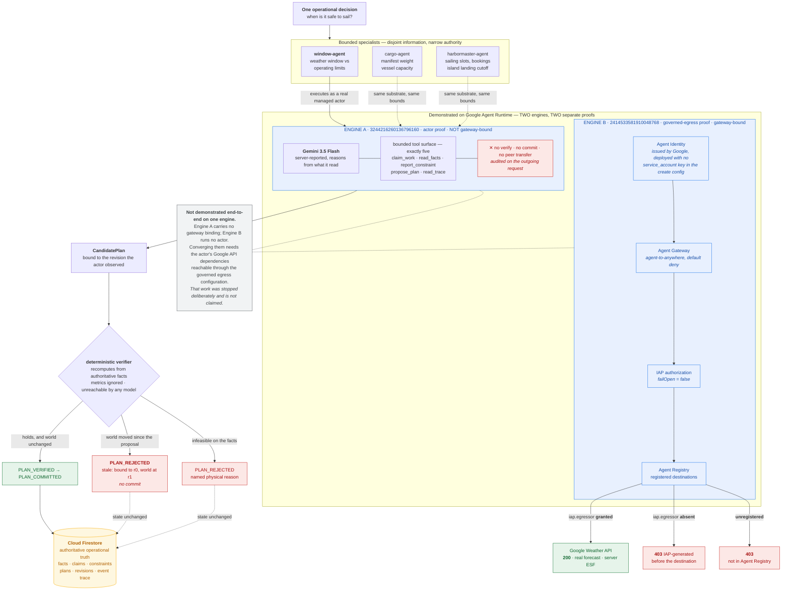
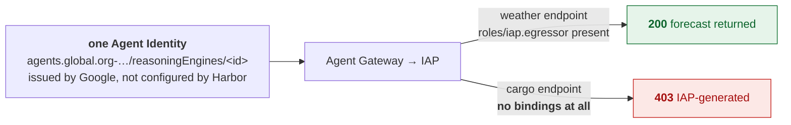
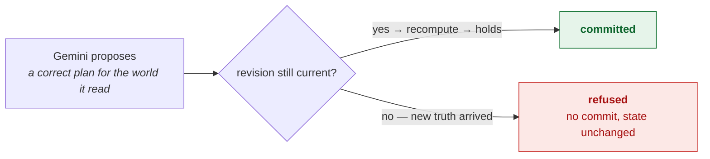
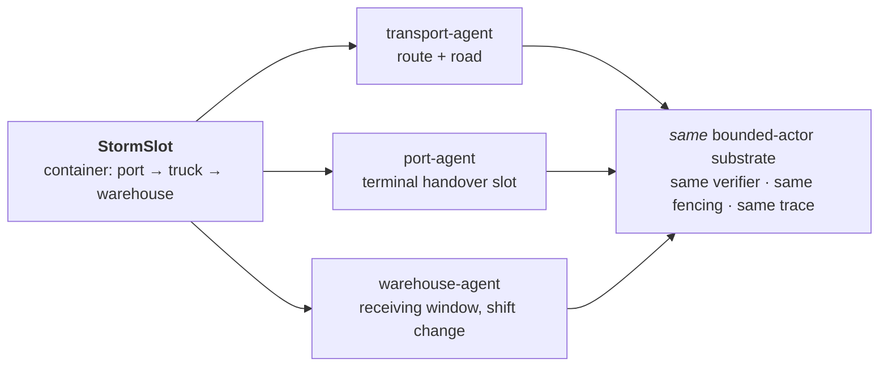

# Harbor architecture

*The **submitted** topology, in regenerable Mermaid source. Obsolete engines,
superseded probes and the quarantined gRPC investigation are deliberately
absent; they are catalogued in `docs/GEAP_CLOUD_INVENTORY.md`, not drawn here.*

## The one-sentence read

> Three bounded specialists coordinate one harbour departure. Google decides who
> the actor is and what it may reach. Gemini proposes. Deterministic code decides
> what becomes true. Firestore holds what is authoritatively true.

## Four authority layers

The system has exactly one decomposition, and it is by **authority** — who is
allowed to decide what. Every diagram and every claim row below sits in one of
these four layers.

| layer | who | authority it holds | what it may **not** do |
|---|---|---|---|
| 1 | **Gemini 3.5 Flash** | reasoning and proposal authority — it reads what it is allowed to read and proposes a plan | it cannot verify, cannot commit, cannot advance a revision, and cannot write authoritative state |
| 2 | **Agent Identity · Agent Gateway · Agent Registry · IAP · IAM** | infrastructure authority — Google decides who the actor is and which destinations that identity may reach | the model has no influence over any of it; and registration in the Agent Registry is not itself an authorization allowlist, because authorization is a per-endpoint IAP IAM grant |
| 3 | **the deterministic verifier, revisions and fencing** | state-transition authority — it recomputes from authoritative facts and decides what is allowed to become true | it is unreachable by any model, and it does not take model-supplied metrics as input |
| 4 | **Cloud Firestore** | authoritative operational truth — committed state, the revision counter, the event trace | nothing becomes true here by being asserted; this layer moves only through layer 3 |

Layer 4 is a layer and not a storage detail. "What is currently true" is a
decision the system defers to exactly one place, and the other three layers are
defined relative to it: a proposal from layer 1 is bound to the revision layer 4
held when the proposal was made, and layer 3 refuses that proposal if layer 4 has
since moved on.

## Primary diagram

Harbor's managed evidence is **two proofs on two Reasoning Engines**, not one
end-to-end run. The diagram says so explicitly, because the honest version is
still strong and the dishonest version is checkable in a minute.



**Read the split deliberately.** Engine A proves that a real managed Gemini runs
Harbor's bounded actor and cannot reach authority: five tools, no verify, no
commit, a CandidatePlan bound to the revision it observed, and a stale proposal
refused. Engine B proves that Google — not Harbor and not the model — decides
what an agent identity may reach: weather allowed, an unbound registered
destination denied, an unregistered destination denied, all before the
destination answers.

Both engines were deployed through the same Agent Identity path, and that claim
is worth scoping to what the files show. `geap/d1_deploy_runtime.py` is the one
deploy script for both: its create config sets
`identity_type: AGENT_IDENTITY` and carries **no `service_account` key at all**
— an absent key being the only way to be sure it was never set. Both deploy
records,
`geap/d1_deployed_v4.json` for A and `geap/d1_deployed_gw5.json` for B, come back
from that call with an engine-bound `effective_identity` in the
`agents.global.org-…` namespace, read from the API response. The literal
control-plane `spec.identityType: AGENT_IDENTITY` with no `serviceAccount` key is
captured by full readbacks on two *other* engines in the same project — the
identity probe (`geap/d0_readback.json`) and the earlier gateway-bound engine
`1047585541886836736` (`geap/d1_gw_readback.json`). That is the boundary of the
claim: one deployment path with the service-account key absent, plus control-plane
GETs showing the resulting shape on the engines that were captured that way.

Neither proof depends on the other, and **no document or artifact in this
repository claims a single engine did both.**

## The two boundaries that carry the claim

Two refusals make layers 2 and 3 visible. Each is enforced by a different system,
and neither is enforced by the model.

### Google decides what the actor may reach



Same identity. Same gateway. Same transport. The only variable is a per-endpoint
IAM grant, and the model has no influence over it.

### Harbor decides what becomes true



The refusal that matters is the second one: the proposal was *right*, and it was
still refused, because the model does not get to decide when its own reasoning is
still true.

## Legend and claim map

Every boundary above is backed by a committed artifact, by a test in this
repository, or by a command that runs here — each row names which. Nothing is
drawn that is not proven.

**Which engine proved what.** `A` = engine `3244216260136796160`, the actor proof.
`B` = engine `2414533581910048768`, the governed-egress proof, which runs **no**
actor. Rows are tagged so no reader has to infer that one engine did both — it
did not. A row tagged with neither letter was proved on something else, and says
what.

The load-bearing negative — *engine A carries no gateway binding* — is scoped to
one artifact. `geap/d1_deployed_v4.json` is engine A's deploy record and reads
`gateway: null`: engine A was created with no `agentGatewayConfig` in the request
at all. The identical field in `geap/d1_deployed_gw5.json` names
`agentGateways/harbor-egress-gw` for engine B, from the same deploy script, so
the difference is a supplied gateway and not a missing capture. What that pair
establishes is the create-time configuration of the two engines; it is not a
sweep of every engine in the project, and no artifact here attributes a
gateway-mediated egress result to engine A.

| # | arrow / boundary | evidence |
|---|---|---|
| 1 *(neither A nor B — identity-probe engine `1562121799313915904`)* | Agent Identity is issued by Google and bound to one engine | `geap/d0_readback.json` — control-plane GET on the identity-probe engine: `spec.identityType: AGENT_IDENTITY`, **no** `serviceAccount` key in the returned `spec`, and an `effectiveIdentity` naming that engine and no other. This row establishes the control-plane *shape* of Agent Identity. It is a capture of the probe engine, not of A or of B; the deployment path A and B share is described above the table |
| 2 **[A]** | Real Gemini executes inside the managed Runtime | `geap/d1_shift_accept.json` — `model_versions_reported: ["gemini-3.5-flash"]`, server-reported |
| 3 **[A]** | Bounded tool surface, exactly five | `geap/d1_shift_accept.json` — `tools_offered_to_model`, read from the outgoing `LlmRequest` |
| 4 | No verify / commit / peer transfer | `tests/test_agents.py`; `app/agents/execution.py::assert_no_authority_tools` audits the request, not the toolkit's own promise |
| 5 **[B]** | The governed-egress engine's egress traverses the Gateway | Scoped to engine `2414533581910048768`, **not** to the actor engine. Committed: `geap/d1_deployed_gw5.json` (deploy record naming `agentGateways/harbor-egress-gw`), plus every record in `geap/gw_logs_rotated.json` and `geap/failclosed/http_triad_gateway.json` arriving through `harbor-egress-gw`. A control-plane readback showing `spec.deploymentSpec.agentGatewayConfig.agentToAnywhereConfig` is committed for the earlier gateway-bound engine `1047585541886836736` (`geap/d1_gw_readback.json`); for `2414533581910048768` it is reproducible live — `GET .../reasoningEngines/2414533581910048768`. The gateway log records name the gateway and the registry endpoint; **they do not carry an engine id**, so the attribution to `2414533581910048768` comes from the controlled invocation and its time window together with the deploy record above, and the `derived_identity_hint` in the probe artifacts is labelled `derived-hint-not-evidence` for that reason. **Harbor's actor engine `3244216260136796160` is not gateway-bound**: its deploy record `geap/d1_deployed_v4.json` reads `gateway: null`, and no artifact in this repository attributes a gateway-mediated egress result to it. |
| 6 **[B]** | Weather **allowed** | `geap/d1_egress_rotated.json` (200, real forecast, `server: ESF`, no IAP header) + `geap/gw_logs_rotated.json` (`authz=ALLOWED`, weather registry endpoint) |
| 7 **[B]** | Cargo **denied** | same pair — `403`, `x-goog-iap-generated-response: true`, `authz=DENIED`; and `geap/iap_endpoint_policies.json` shows the cargo endpoint has **no bindings at all** |
| 8 **[B]** | Unregistered **denied** | same pair — *"…unregistered in the Agent Registry."*, no registry attribution in the gateway log |
| 9 **[B]** | The gateway binding is what changes the outcome — a negative control | `geap/d1_egress_nogw2.json` — identical probe on a **non**-gateway engine reaches both denied destinations freely: row 2 `ALLOWED 200`, row 3 `ALLOWED 200`. *(Row 1, weather, is a 401 there — OAuth bearer instead of an API key. Show rows 2–3 only.)* |
| 10 | IAM names the agent principal, and that is the identity the runtime presents | `geap/iam_project_agent_principals.json` — the two roles Harbor grants are bound to per-engine `principal://…` members: `roles/aiplatform.user` to seven and nothing else; `roles/datastore.user` to those seven **plus** a pre-existing `serviceAccount:…-compute@developer…` that Harbor did not grant and that the runtime does not authenticate as. Neither binding carries a `principalSet` or a project-wide role. The file's one `principalSet://` is Google's own default `roles/aiplatform.agentDefaultAccess`, which Harbor did not create. The artifact is filtered to the agent-identity trust domain and says so; `gcloud projects get-iam-policy harbor-storm-fleet` is the unfiltered check. |
| 11 | Agent Identity IAM enforcement stayed live while token sharing was permitted | `geap/firestore_iam_enforcement_legs.json` — the **401 → 403 → 403** enforcement legs. `GOOGLE_API_PREVENT_AGENT_TOKEN_SHARING_FOR_GCP_SERVICES=False` means token sharing is **permitted**; it does not mean Agent Identity IAM was switched off, and the **403** is what shows the difference, because a refusal names an identity that was evaluated. The later success is a *different* artifact, `geap/d1_shift_accept.json` (`committed_plan_id: harbor-agent-plan-1`) — the legs file is a `severity=ERROR` query and contains no success leg |
| 12 **[A]** | Verifier accepts and commits | `geap/d1_shift_accept.json` — `PLAN_PROPOSED window-agent` → `PLAN_VERIFIED verifier` → `PLAN_COMMITTED verifier` |
| 13 **[A]** | Verifier refuses a stale proposal | `geap/d1_shift_control.json` — `verifier_decision: "rejected"`; the `PLAN_REJECTED` trace event carries `stale: plan bound to revision 0, world is at revision 1`; `authoritative_state.committed_plan_id: null`; no `PLAN_VERIFIED` in the trace |
| 14 | Verifier refuses on physical infeasibility | `app.demo harborwindow --pretty` — `PLAN_REJECTED … harbor wind 42 kph over limit at hour 12` |
| 15 | Firestore is authoritative operational truth | `geap/d1_shift_accept.json` — after the managed run `geap-d1-shift-4`, `authoritative_state` reads `committed_plan_id: harbor-agent-plan-1` alongside the full event trace, so the committed transition is state held in the store rather than a return value of the process that produced it. The property itself is asserted by `tests/test_store_contract.py`: **one contract, both backends** — every semantic the scenarios depend on is run against `InMemoryStateStore` and, with a Firestore emulator reachable, against `FirestoreStateStore`, each run reopened through a second store instance, which for Firestore is a genuine rehydration from the database. Swapping the backend cannot quietly change what "atomic claim" or "commit only if verified" means |
| 16 **[B]** | `failOpen: false` | `geap/failclosed/authz_extension_readback.json` — the readback of `authzExtensions/harbor-iap-authz` carries `service: iap.googleapis.com`, `timeout: 1s`, `metadata.iapPolicyVersion: V1` and **no `failOpen` key at all**; proto3 omits default-valued booleans, so the absence *is* `false`. The pre-change readback of the same resource, `geap/d1_iap_extension.json`, carries `"failOpen": true` explicitly — same resource, same payload shape — so the absence is a change that landed and not a field the capture dropped. **This is a demonstrated configuration property. Outage behaviour was never experimentally induced: nothing here shows what the gateway does when IAP is actually unreachable.** Detail in `docs/GATEWAY_FAIL_CLOSED.md` |
| 17 | The substrate is not scenario-specific | `app.gate` — StormSlot and HarborWindow both 5/5 mechanical, on the same six hard gates: five mechanically checked and one manual demo-legibility gate |

## Deliberate omissions

- **The deterministic lane is not drawn.** Seeded providers, `app.demo` and
  `app.gate` are how the system is *verified*, not how it runs in production.
  Drawing them beside the live path would imply the test harness is part of the
  product. Reproducibility belongs in the README.
- **Only `window-agent` is shown executing as a managed Gemini actor.** That is
  what the proven vertical slice covers. `cargo-agent` and `harbormaster-agent`
  hold the same bounds on the same substrate but publish their constraints
  deterministically in the current proof — drawn dashed for that reason.
- **The actor path and the governed-egress proof currently run on two Reasoning
  Engines.** Each control is independently demonstrated. Collapsing them onto one
  engine needs the actor's Google API dependencies — Vertex AI and Firestore —
  reachable through the governed egress configuration: registered in the Agent
  Registry **and** granted per-endpoint IAP authorization, because registration
  is not itself an authorization allowlist. Row 7 is exactly that case: a
  registered endpoint with no binding, refused.
- **No historical clutter**: superseded engines, failed iterations, IAM-propagation
  archaeology and the quarantined gRPC investigation are in the evidence
  inventory, not the submission diagram.

## StormSlot — same substrate, different geometry



Scenarios are configurations over one substrate, not separate infrastructure.
Both pass the same six hard gates — five mechanically checked and one manual
demo-legibility gate — and their traces are the same shape and the same length,
which is the actual claim.

## Engineering decisions

Three decisions shape the system more than any component choice does.

### The stale-world invariant

A plan is bound to the revision of the world it was built from.

```text
candidate created at revision R
        ↓
world advances to R+1
        ↓
the old candidate can no longer verify or commit
```

A proposal that was correct when it was made is not thereby correct when it
lands. This matters more, not less, once agents run asynchronously — sleeping,
resuming and proposing against a world that moved while they were away. The
verifier refuses on the binding itself, not on a re-reading of the plan's
contents, so a stale candidate fails even when its actions still look sensible.
Evidence: `geap/d1_shift_control.json` (claim 13) and `tests/test_stale_plan.py`.

### Evidence is tied to fixed repository state

Every number in this repository — test counts, gate results, trace excerpts,
control-plane readbacks — is collected against a fixed, recorded commit and
verified before it is promoted into a claim. The tree submitted here is
engineering SHA `687eebfd26f64d87f3c8db49756f838dc90bc02a`.

Evidence collected from a moving tree is void. Before any run whose numbers are
quoted, the tree must be a known committed SHA with no uncommitted or untracked
changes — an untracked `conftest.py` or `sitecustomize.py` can change what a run
does while the committed SHA still looks certified. Every quoted number is
stamped with the HEAD SHA and capture time. The gate fails closed: if a
precondition does not hold, evidence collection stops rather than proceeding with
a caveat.

The rule exists for one reason:

> **A control that depends on someone being suspicious is not a control.**

Measurements taken against state that is concurrently changing are
indistinguishable from correct ones at the moment they are read; they are only
distinguishable later, by which point they have been quoted. So the check is
mechanical and refuses to produce a number at all when its preconditions do not
hold.

### Legacy packaging is retained, not submitted

`Dockerfile`, `.dockerignore` and `deploy/` describe an earlier Cloud Run and
Pub/Sub packaging path. They remain in the frozen baseline because
`tests/test_packaging.py` asserts on them, and removing them would mean editing
frozen tests. They are **not** part of the submitted runtime topology, which is
the managed Agent Runtime path drawn above.
